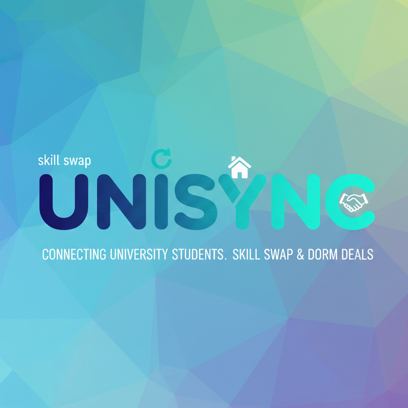
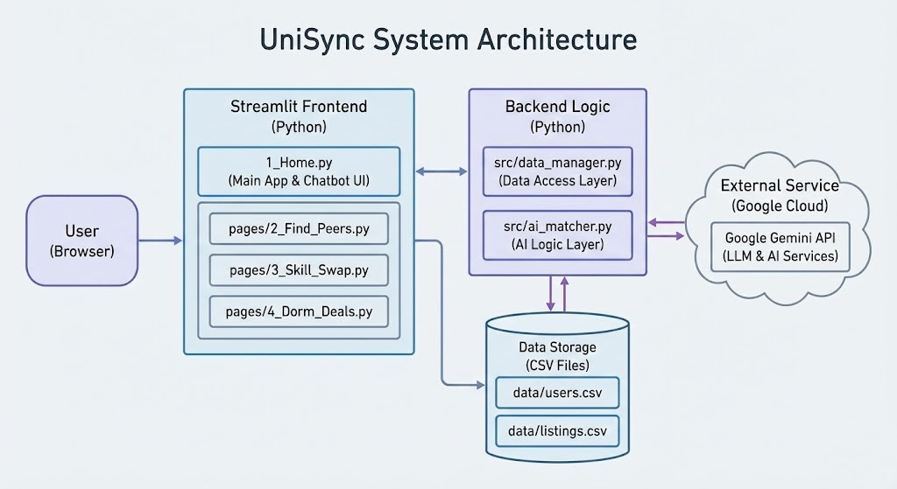
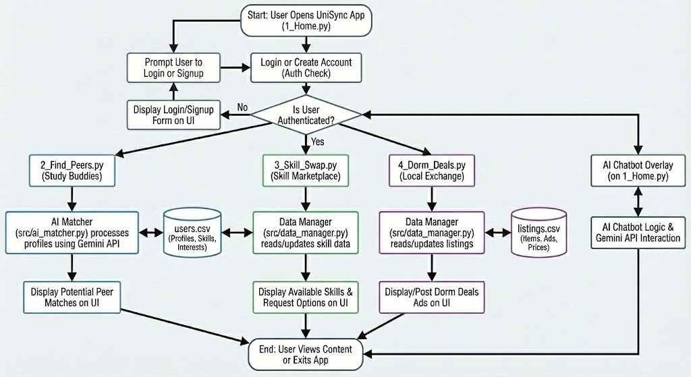

<div align="center">



# 🤝 UniSync - The Student Ecosystem

**One campus. Endless connections.**

[](LICENSE)
[](https://www.python.org/downloads/)
[](https://streamlit.io)
[](https://ai.google.dev/)
[](https://unisync.streamlit.app/)

*A unified platform that bridges the gaps in campus life by connecting students for peer collaboration, skill exchange, and resource sharing*

[Features](#-features) • [Quick Start](#-quick-start) • [Architecture](#-architecture) • [License](#-license)

</div>

---

## 🎯 Overview

UniSync is an AI-powered campus ecosystem that solves three major student disconnects: finding study buddies, skill exchange, and resource sharing. Built with Streamlit and powered by Google Gemini AI.

> **Note:** IIT Delhi is used as a sample campus context for demonstration purposes. UniSync can be adapted for any university.

---

## 🎯 The Problem

Students face three major disconnects on campus:
1. **Finding study buddies** - Hard to find peers with similar courses/interests
2. **Skill exchange** - Wasted potential when students can't find teachers/learners
3. **Resource sharing** - Scattered accommodation/furniture/textbook marketplaces

## 💡 Our Solution

UniSync combines four powerful features:

- **🎓 Campus Tribe**: Tinder-style peer matching with advanced filters
- **🔄 Skill Swap**: Student-led teaching marketplace
- **🏢 Dorm Deals**: Campus marketplace for resources
- **🤖 AI Assistant**: Gemini-powered smart recommendations

---

### 1. 🎓 Campus Tribe - Smart Peer Matching
- Tinder-style swiping through student profiles
- Filter by major, year, skills, interests
- X-Factor showcasing (unique talents)
- Persistent connections with contact info

### 2. 🔄 Skill Swap - Student-Led Teaching
- Browse available teachers by category (Tech/Creative/Academic)
- Find learners seeking specific skills
- Direct email connections for skill exchange
- Showcase your X-Factor teaching abilities

### 3. 🏢 Dorm Deals - Campus Marketplace
- Post and browse accommodation, furniture, textbooks, electronics
- Advanced filtering (type, price, location, free items)
- Sorting options for easy discovery
- Quick links to campus resources

### 4. 🤖 AI Campus Assistant
- Powered by Google Gemini
- Natural language queries ("Find someone to study calculus with")
- Smart matching based on skills, interests, accommodation needs
- Personalized recommendations with contact details

---

## 🛠️ Tech Stack

| Component | Technology | Purpose |
|-----------|-----------|------|
| **Frontend** | Streamlit with custom CSS | Glassmorphism UI design |
| **AI Engine** | Google Gemini Flash 1.5 | Smart matching & recommendations |
| **Security** | SHA-256 hashing | Password encryption |
| **Storage** | CSV files | Lightweight data persistence |
| **Deployment** | Streamlit Cloud | Live hosting |
| **Language** | Python 3.8+ | Core application logic |

---

---

## ✨ Features

- **🔐 Secure Authentication**: SHA-256 password hashing, reset functionality
- **👥 Smart Peer Matching**: Swipe interface with advanced filtering
- **⭐ Rating System**: 5-star reviews and trust scores
- **🎓 Skill Marketplace**: Dual teaching/learning platform
- **🏪 Campus Marketplace**: Multi-category resource sharing
- **🤖 AI Recommendations**: Context-aware matching with Gemini
- **🎨 Modern UI**: Glassmorphism design with smooth animations

---

---

## 🚀 Quick Start

### Prerequisites
- Python 3.8 or higher
- Google Gemini API keys ([Get one here](https://ai.google.dev/))

### Installation

```bash
# Clone the repository
git clone https://github.com/yourusername/unisync.git
cd unisync

# Install dependencies
pip install -r requirements.txt
```

<details>
<summary><b>🔐 API Key Configuration (Click to expand)</b></summary>

<br>

**Important**: Never commit your API keys to version control!

1. Create a secrets configuration file for Streamlit and add your Gemini API keys:
```toml
GEMINI_API_KEY = "your-api-key"
```

2. Store this file securely and ensure it's excluded from version control

**Optional**: Add up to 10 keys for automatic rotation on quota limits

</details>

```bash
# Run the application
streamlit run 1_Home.py
```

The app will open at `http://localhost:8501`

### First-Time Setup
1. Create account or login from sidebar
2. Complete your profile with skills and interests
3. Start swiping in Campus Tribe to find peers
4. Browse Skill Swap and Dorm Deals
5. Use AI Assistant for smart recommendations

---

---

## 🏗️ Architecture

### System Architecture



UniSync follows a modular architecture:
- **Frontend Layer:** Streamlit pages (Home, Find Peers, Skill Swap, Dorm Deals)
- **Backend Logic:** Python modules for data management and AI matching
- **Data Layer:** CSV-based storage for users, listings, connections, ratings
- **External Services:** Google Gemini API for AI-powered recommendations

### Application Flow



1. User authentication (login/signup)
2. Access to three main features (Campus Tribe, Skill Swap, Dorm Deals)
3. AI chatbot overlay for intelligent matchmaking
4. Data persistence across sessions

---

## 📁 Repository Structure

```
Unisync/
├── 1_Home.py                 # Main application entry point
├── pages/
│   ├── 2_Find_Peers.py       # Peer matching interface
│   ├── 3_Skill_Swap.py       # Skill exchange marketplace
│   ├── 4_Dorm_Deals.py       # Campus marketplace
│   ├── 5_Reviews.py          # User reviews and ratings
│   └── 6_Guide.py            # User guide and documentation
├── src/
│   ├── ai_matcher.py         # AI matching logic with Gemini
│   ├── data_manager.py       # Data access layer (CRUD operations)
│   ├── ui_components.py      # Reusable UI components
│   └── utils.py              # Helper functions
├── data/
│   ├── users.csv             # User profiles
│   ├── listings.csv          # Marketplace listings
│   ├── connections.csv       # User connections
│   ├── passwords.csv         # Hashed passwords
│   └── ratings.csv           # User ratings and reviews
├── assets/
│   ├── logo.png              # UniSync logo
│   ├── Flow.jpg              # Application flow diagram
│   ├── sysarc.jpg            # System architecture diagram
│   └── style-*.css           # Custom CSS for each module
├── .streamlit/
│   ├── config.toml           # Streamlit configuration
├── requirements.txt          # Python dependencies
└── README.md                 # Project documentation
```

---

## 📖 Usage

**Campus Tribe**: Swipe through profiles → Filter by major/skills → Connect with matches

**Skill Swap**: Browse skills → Find teachers/learners → Exchange knowledge

**Dorm Deals**: Post listings → Filter by type/price → Contact sellers

**AI Assistant**: Ask natural language queries → Get personalized recommendations

---

## 🔧 Configuration

<details>
<summary><b>Data Files Format</b></summary>

**Users** (`users.csv`):
```csv
id,name,email,year,major,skills,interests,x_factor,can_teach,wants_to_learn,accommodation_need
1,Alex Chen,alex@campus.edu,Junior,Computer Science,Python...
```

**Listings** (`listings.csv`):
```csv
id,user_id,type,title,description,location,price,status
1,2,furniture,Study Desk,Good condition,Dorm B,Free,available
```

</details>

---

## 🐛 Troubleshooting

- **AI not responding**: Check API keys in secrets.toml, verify internet connection
- **Login failed**: Ensure password is correct, try password reset
- **No matches found**: Adjust filters, add more skills to profile
- **Quota exceeded**: Add more API keys for automatic rotation

---

## 📝 License

MIT License - see [LICENSE](LICENSE) file

---

## 👥 Team

<div align="center">

<table>
  <tr>
    <td align="center">
      <a href="https://github.com/Mikky-mlh">
        <br />
        <sub><b>Yuvraj Sarathe</b></sub>
      </a><br />
      Full-stack development, AI integration, system architecture
    </td>
    <td align="center">
      <a href="https://github.com/siddhikadhanelia">
        <br />
        <sub><b>Siddhika Dhanelia</b></sub>
      </a><br />
      Peer matching, skill swap, frontend design
    </td>
    <td align="center">
      <a href="https://github.com/Aaradhya4127">
        <br />
        <sub><b>Aaradhya Tiwari</b></sub>
      </a><br />
      Dorm deals, filtering/sorting, data management
    </td>
  </tr>
</table>

</div>

---

<div align="center">

**⭐ Star this repo if UniSync helped you connect with your campus community!**

**Made with ❤️ for the student community | UniSync © 2026**

*Connecting students, one swipe at a time.* 🤝

</div>
